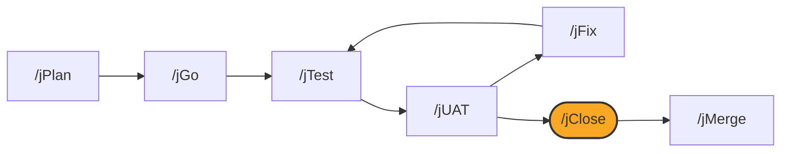

# /jClose

## Diagram



## What it is

`/jClose` closes a work item: it writes a mandatory retro, syncs the tracker
through the tracker boundary when one is configured, updates the plan's
status, and records the close locally. It does not re-verify that the work
is actually done; that confirmation is yours, normally because `/jGo`
finished the build and, when the loop needed them, `/jTest`, `/jUAT`, and
`/jFix` already ran.

## When to use it

Run `/jClose` once the UAT round is clean and you are ready to integrate the
branch with `/jMerge`.

## Options

```
/jClose               # auto-detect the work item from the current branch or newest state
/jClose <work-item>    # explicit tracker key (PS-14) or slug (add-csv-export)
```

Invoked with no arguments, `--help`, or `status`, `/jClose` only inspects
and reports.

## What it writes

- `.jswarm/work/<id>/retro.md`: a structured retrospective, appended to if
  one already exists
- A tracker comment and transition, attempted only when a tracker is
  configured; skipped with a printed reason otherwise
- The plan's status, advanced to ready for merge
- `.jswarm/work/<id>/close.json`: the close record `/jMerge` requires before
  it will run

## See also

- [How the loop works](../how-the-loop-works.md)
- [Working without a tracker](../without-jira.md)
- [jMerge](jMerge.md)
