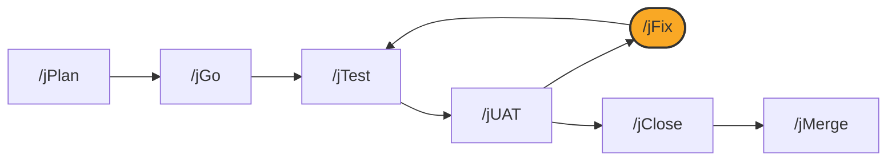

# /jFix

## Diagram



## What it is

`/jFix` diagnoses a described problem, writes a plain-language repair
contract for you to approve before touching production code, makes the
smallest change that contract describes, and proves the fix. **Public
`/jFix` diagnoses on its own; it does not hand off to another agent for
triage before starting**, and it does not close acceptance on its own.

## When to use it

Run `/jFix <description>` whenever a UAT round, a test run, or your own use
of the application finds something wrong. Describe the symptom in your own
words; do not guess the cause or point at a file.

## Options

```
/jFix <description of what's broken | error message | test name>
/jFix --diagnose-only <description>   # stop after diagnosis; no contract, no repair
```

The default flow stops after Step 2 (the contract) until you approve it;
`--diagnose-only` stops even earlier, after Step 1, with no contract and no
repair.

## What it writes

- A diagnosis, citing the evidence for the causal mechanism
- A repair contract, stating what will and will not change, for your approval
- A test that fails for the identified mechanism before the fix, and passes
  after it
- The repair itself, and a report of which proof forms passed

## See also

- [How the loop works](../how-the-loop-works.md)
- [jTest](jTest.md)
- [jClose](jClose.md)
