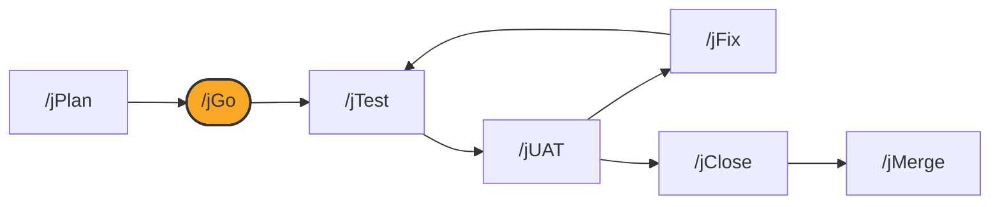

# /jGo

## Diagram



## What it is

`/jGo` is the canonical executor. It resolves the plan `/jPlan` wrote,
implements it phase by phase, and flips the plan's status once every phase
is accepted. **`/jGo` builds and stops: it does not run `/jTest` beyond what
the plan's own phases already require, and it does not issue a UAT round.**

## When to use it

Run `/jGo` once `/jPlan` has produced a plan you are ready to build against.
Run it again to resume an in-progress plan; it picks up at the next
incomplete task.

## Options

```
/jGo                          # auto-detect a plan
/jGo <work-item>               # resolve a specific work item's plan
/jGo path/to/plan.md           # explicit plan path
/jGo status                    # progress only, no write
/jGo --help                    # usage only
/jGo <work-item> --phased      # stop after each accepted phase (default)
/jGo <work-item> --continuous  # continue through accepted phases without stopping
```

Invoked with no arguments, `--help`, or `status`, `/jGo` only inspects and
reports. A missing or non-executable plan blocks and routes you to `/jPlan`;
a plan already marked ready for merge or done requires confirmation before
re-running.

## What it writes

- `feat/<id>`, if it does not already exist and you are still on the
  repository's default branch. `/jClose`, `/jMerge`, and `/jUAT` all resolve
  against this branch, so `/jGo` is where it comes from. Already on a branch
  of your own for this work? `/jGo` leaves it alone and builds there instead.
- Implementation commits on that branch
- Tests added alongside the implementation
- Updates to the plan's phase and status tracking, ending in
  `READY_FOR_MERGE` once every phase is accepted

## See also

- [How the loop works](../how-the-loop-works.md)
- [jPlan](jPlan.md)
- [jTest](jTest.md)
