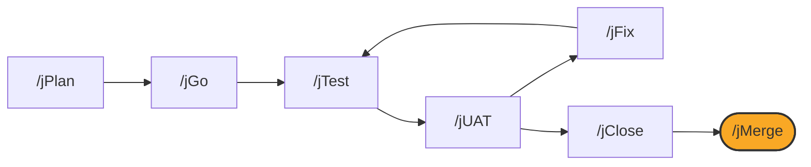

# /jMerge

## Diagram



## What it is

`/jMerge` integrates a closed work item's branch into the target branch:
fetch, rebase or merge per the project's setting, push, open a pull request
when one is configured, confirm the tracker reflects the close, and delete
the branch. **`/jMerge` is the last stage of the loop; there is no next
lifecycle command.**

## When to use it

Run `/jMerge` after `/jClose` has recorded the close. `/jMerge` refuses to
run if `.jswarm/work/<id>/close.json` is absent, and tells you to run
`/jClose` first.

## Options

```
/jMerge               # auto-detect the work item from the current branch
/jMerge <work-item>    # explicit tracker key or slug
/jMerge --dry-run      # print every action; write nothing
```

Invoked with no arguments, `--help`, or `status`, `/jMerge` only inspects
and reports; push and branch deletion require explicit confirmation, or an
approved dry run first. A real merge conflict stops here and is presented
directly; `/jMerge` does not auto-resolve content conflicts.

## What it writes

- The merge or rebase itself, and the push to the target branch
- A pull request, when `.jswarm/config.yaml` names a PR host
- The plan's status, advanced to merged
- The source branch, deleted both locally and on the remote

## See also

- [How the loop works](../how-the-loop-works.md)
- [jClose](jClose.md)
