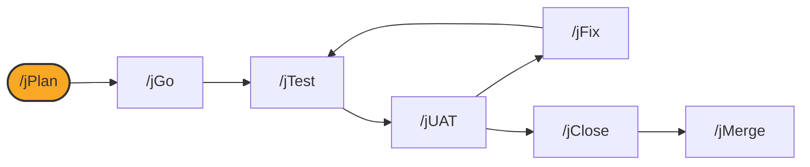

# /jPlan

## Diagram



## What it is

`/jPlan` is the first command in the loop. It resolves a work item's
identity, either a tracker key like `PS-14` or a local slug like
`add-csv-export`, writes local state for it, and produces a plan file (and,
for standard and deep modes, a technical design spec) that `/jGo` executes
against.

## When to use it

Run `/jPlan <work-item>` at the start of every new piece of work, before
anything else in the loop. Run it again against the same work item if the
plan needs to change mid-stream.

## Options

```
/jPlan <work-item>       # standard mode: full spec and plan
/jPlan --lite            # briefing-only mode: ticket and context, no full spec
/jPlan rapid-vibe-ui      # owner-approved rapid mode for existing-UI refinement
```

`<work-item>` accepts either a tracker key (`^[A-Z][A-Z0-9]+-\d+$`, for
example `PS-14`), meaningful only once a tracker is configured, or a slug
(`^[a-z0-9][a-z0-9-]*$`, for example `add-csv-export`), always available. If
the argument looks like a tracker key and no tracker is configured, `/jPlan`
stops with an actionable message rather than inventing a placeholder key or
silently downgrading it to a slug.

## What it writes

- `.jswarm/work/<id>/`: local work item state
- `.jswarm/plans/<id>.plan.*.md`: the plan file `/jGo` executes
- A technical design spec, for standard and deep modes
- With a tracker configured, an update to the tracker issue

## See also

- [How the loop works](../how-the-loop-works.md)
- [Working without a tracker](../without-jira.md)
- [jGo](jGo.md)
