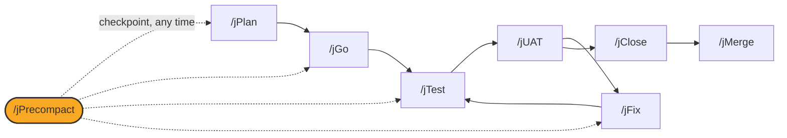

# /jPrecompact

## Diagram



## What it is

`/jPrecompact` checkpoints in-progress work before an agent session's
context is compacted, so state, progress, and lessons learned survive the
compaction. It is not part of the `/jPlan` through `/jMerge` sequence; you
can run it at any point while a work item is active, whether or not `/jGo`
is currently running.

## When to use it

Run `/jPrecompact` whenever you want to safely compact context during a long
session, or whenever your agent host prompts you that context is running
low. Use `--lite` for a fast, minimal checkpoint when you only need session
continuity.

## Options

```
/jPrecompact                    # full checkpoint protocol
/jPrecompact <work-item>         # checkpoint a specific work item
/jPrecompact --lite              # minimal continuity checkpoint
/jPrecompact --fast              # alias for --lite
```

Full mode runs a promotion-review gate before writing checkpoint surfaces,
so you can approve, deny, or request changes to plan items that look ready
to move forward. Lite mode skips that gate and records only session state,
a scoped plan status update, and retros for the current session's activity.

## What it writes

- Session-continuity state for the active work item
- A scoped update to the plan's status tracking
- Retro entries for lessons from the current session, using the same
  canonical retro location `/jClose` writes to

## See also

- [How the loop works](../how-the-loop-works.md)
- [jGo](jGo.md)
- [jClose](jClose.md)
