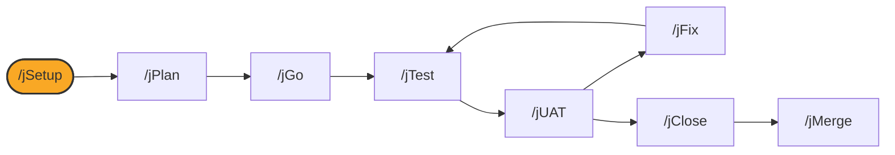

# /jSetup

## Diagram



## What it is

`/jSetup` is the guided, agent-driven day-0 front door for a fresh jSwarm
clone. It is the same doctor-and-guide flow as `./install.sh check`, run from
inside a Claude Code session instead of a terminal, so a coding agent can
walk you through the checks, show you the dry run, and pause wherever you
need to sign in or make a decision.

## When to use it

Use `/jSetup` the first time you install jSwarm, or any time you want a
guided pass instead of the manual `./install.sh` steps in
[Getting started](../getting-started.md). It is read-only until you approve
a change.

## Options

```
/jSetup                # inspect and guide; no write
/jSetup --help          # usage only
/jSetup status          # progress only
```

Invoked with no arguments, `--help`, or `status`, `/jSetup` only inspects and
reports. Any state-changing step requires your explicit confirmation, or an
approved dry run first.

## What it writes

Nothing, on its own. `/jSetup` guides you through the same installer steps
documented in [Getting started](../getting-started.md) (`check`, `install`,
`verify`, `adopt`); each of those writes what its own man page or the
Getting started guide describes, only after you confirm.

## See also

- [Getting started](../getting-started.md)
- [jPlan](jPlan.md)
