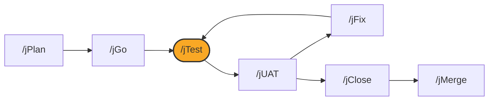

# /jTest

## Diagram



## What it is

`/jTest` is the single entry point for the testing family: choosing a
testing strategy, running automated tests, and driving an agent-led smoke
walk, ahead of the human UAT round that `/jUAT` issues. It covers level 1
(automated unit and integration tests) and level 2 (an agent smoke walk)
of the three levels of proof described in
[How the loop works](../how-the-loop-works.md). **`/jTest` does not close
anything**, and it does not issue a UAT round on its own; that is `/jUAT`.

## When to use it

Run `/jTest` after `/jGo` finishes building, and again after `/jFix` repairs
something the UAT round found, before re-issuing a round.

## Options

```
/jTest                  # run the project's automated tests and the agent smoke walk
/jTest --help            # usage only
```

`/jTest` is also the front door for choosing a testing strategy during
`/jPlan` or `/jGo`, and for proving backend-only work that has no UI or user
journey impact, without a UAT round.

## What it writes

- Automated test run results
- Updates to the plan's testing strategy fields, when run during planning
- A record of the smoke walk, consumed by `/jUAT` when a round is issued

## See also

- [How the loop works](../how-the-loop-works.md)
- [jUAT](jUAT.md)
- [jFix](jFix.md)
