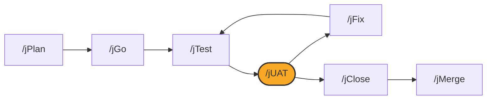

# /jUAT

## Diagram



## What it is

`/jUAT` is a small menu of UAT-scenario utilities that sit behind issuing a
round to the local review portal at `http://localhost:8766/uat/`. It
prepares the journeys a human walks; **it does not approve them for you**,
and it does not close anything on its own.

## When to use it

Run `/jUAT` after `/jTest` passes, to issue a round for someone to walk in
the portal. Run it again, with an option, to author a new scenario or
populate scenario content mid-ticket.

## Options

```
/jUAT                     # show the menu and ask which option to run
/jUAT 1                   # extract slide images from a PDF into scenarios
/jUAT extract-assets       # same, by name
/jUAT 2                   # populate scenario content (preview-gated)
/jUAT populate-content     # same, by name
/jUAT 3                   # author a new UAT scenario mid-ticket (preview-gated)
/jUAT author-scenario      # same, by name
```

An unrecognized option shows the menu and stops. Extra flags (for example
`--pdf`, `--scenarios`, `--source`) pass through to the routed option.

## What it writes

- A numbered round file for the current work item, read by the portal
- Canonical UAT scenario JSON and its rendered Markdown, once you approve a
  preview
- Findings recorded back to the repository once you walk a round in the
  portal

## See also

- [How the loop works](../how-the-loop-works.md)
- [jTest](jTest.md)
- [jFix](jFix.md)
