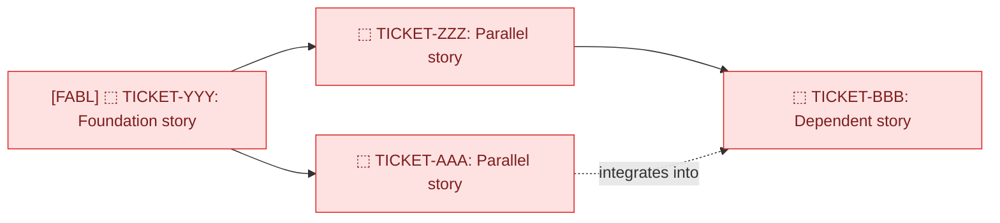
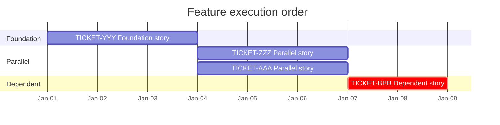

## Trigger

Issue type Feature; this is selected by the `issue type Feature → FEATURE` ceremony mapping.

## Header lines

**Integration Defects:** [TICKET-XXX-integr-fixes.md](TICKET-XXX-integr-fixes.md)
**PE2E Defects:** [TICKET-XXX-pe2e-fixes.md](TICKET-XXX-pe2e-fixes.md)

## Plan sections

## Feature Context

> **Agents: READ THESE DOCUMENTS before starting implementation.**
>
> | Document | Path | Relevant Sections |
> | -------- | ---- | ----------------- |
> | **Vision / Roadmap** | `docs/plans/...` | [which sections are relevant] |
> | **Architecture** | `docs/architecture/...` | [which sections are relevant] |
> | **Technical Design Spec** | `docs/plans/TICKET-XXX.specs.md` | Full spec |
> | **Related Plans** | `docs/plans/...` | [dependency plan files] |

---

## Agent & Delegation Recommendations

> **Routing rule:** Use prescribed named agents only. Do not use `task(category=...)`; OMO category dispatch can spawn `Sisyphus-Junior`.

| Attribute | Recommendation |
| --------- | -------------- |
| **Lead Agent** | [named agent slug, e.g. `executor`, `jCoder (craftsmanship mode)`, `jTestEngineer`, `designer`, `jQATester`] |
| **Why** | [rationale for named agent choice] |
| **Skills to Load** | `colgrep-search`, `tool-order` |
| **Execution Order** | [which stories are unblocked, which have dependencies] |

**Delegation within feature:**

| Story | Jira | Plan File | Delegate To | Rationale |
| ----- | ---- | --------- | ----------- | --------- |
| US-XX.01 | [TICKET-YYY](https://your-jira.atlassian.net/browse/TICKET-YYY) | [TICKET-YYY-DESC.md](TICKET-YYY-DESC.md) | [named agent slug] | [why this agent] |
| US-XX.02 | [TICKET-ZZZ](https://your-jira.atlassian.net/browse/TICKET-ZZZ) | [TICKET-ZZZ-DESC.md](TICKET-ZZZ-DESC.md) | [named agent slug] | [why this agent] |

**Key risk:** [single biggest risk across all stories]

### Agent Delegation Protocol

The orchestrating agent should **coordinate and delegate** to specialized sub-agents, not do all the work itself. "Lead agent directly" means Opus orchestrates; it should still delegate code writing to `executor` and other sub-agents as appropriate.

| Work Type | Delegate To | Example |
| --------- | ----------- | ------- |
| **Code writing** | `executor` (Sonnet) or `jCoder (craftsmanship mode)` | Backend endpoints, UI components, service logic |
| **Architecture / design review** | `oracle` (GPT xhigh) or `jOracle` (GPT high) | Risk assessment, design validation |
| **Code review** | `code-reviewer` (Opus) or `jCritic` (GPT) | Quality gate before marking complete |
| **UI/UX work** | `designer` (Gemini) | Frontend components, layout changes |
| **Test writing** | `jTestEngineer` (Sonnet) | Unit tests, E2E specs, TDD workflows |
| **Debugging** | `debugger` (Sonnet) | Root cause analysis, stack trace investigation |
| **Verification** | `verifier` (Sonnet) | Evidence-based completion checks |

**Rules:**
1. Opus plans, breaks work into tasks, delegates, and reviews; it does not write hundreds of lines of code itself
2. Run independent sub-agents in parallel (e.g., backend executor + frontend executor)
3. Never self-approve: use `code-reviewer` or `verifier` for the review pass
4. Inject `colgrep-search` skill and necessary file context into sub-agent prompts

### Orchestrator model routing

**Rule:** every ticket names its recommended ORCHESTRATOR model: the main Claude Code session that runs `/jPlan`/`/jGo`/`/jMerge` for that ticket. **`claude-fable-5` [FABL]** is required for tickets with broad architecture seams to track and coordinate: anything doing surgery on the pipeline (workflow orchestration, merge/reducer, replay/durability, provider routing spine, multi-hot-zone coordination). **`claude-opus-4-8` [OPUS]** is better suited to narrower, bounded, or front-end tickets. This routes the ORCHESTRATOR only; named j-core subagents stay route-pinned by their own frontmatter and are never overridden by this table. Flow-diagram nodes above carry the same `[FABL]`/`[OPUS]` tags; landed nodes carry none. (These are the CURRENT recommendation set; future model generations substitute at the same two tiers: broad-seam tier vs bounded tier.)

**Effort rule:** default the fable-5 orchestrator to **HIGH** and escalate to **XHIGH** per ticket or per phase; effort tracks **decision irreversibility, not ticket size** (test: "if the orchestrator subtly misjudges here, does a later gate catch it?", yes → HIGH; this IS the last gate → XHIGH). Deep reasoning is already delegated to route-pinned xhigh lanes; orchestrator XHIGH earns its latency only at adjudication moments. Each child ticket plan carries a **⚡ ORCHESTRATOR EFFORT callout** near its title, and phase-boundary reminders where effort changes mid-ticket; **the orchestrator MUST surface the reminder to the owner at that phase entry** so the owner flips the session effort. Opus tickets run HIGH uniformly (floor, never below).

**[FABL]: broad-seam / pipeline surgery:**

| Ticket | Complexity | Effort | Why fable-5 |
| --- | --- | --- | --- |
| TICKET-YYY | HIGH | HIGH; **XHIGH at <phase gate>** | [why broad seams] |

**[OPUS]: narrow / bounded / front-end (effort: HIGH uniformly, the floor, never below):**

| Ticket | Complexity | Why opus-4-8 suffices |
| --- | --- | --- |
| TICKET-ZZZ | [LOW | MEDIUM | HIGH] | [why bounded scope] |

---

## Summary

[2-3 sentences: What this feature accomplishes, why it matters, and the high-level implementation approach.]

---

## PE2E Test Contracts

> **Feature-Level TDD: Define these contracts BEFORE writing User Stories below.**

### PE2E-001: [Journey Name]

**Journey:** [User does X, sees Y, does Z, outcome is W]

| Step | User Action | Expected Outcome | Assertion Type | Assertion Target | Expected Value | Responsible Story | Evidence Bundle |
|------|-------------|-----------------|----------------|-----------------|----------------|-------------------|-----------------|
| 1 | [action] | [outcome] | [ARIA snapshot / bounding box / text content / assertUrl / DOM count] | [selector, URL pattern, or element description] | [exact text, min dimensions, URL regex, count] | TICKET-YYY | [screenshot ID + what to verify visually] |

**Assertion Type Reference** (from Assertion Decision Table):
- **Standard HTML elements:** ARIA snapshot + text content
- **React Flow / Canvas:** bounding box + DOM count
- **Navigation:** assertUrl(pattern)
- **"User sees X":** bounding box mandatory (toBeVisible misses zero-height)

---

## UAT Scenario Alignment

> Map this Feature to the project's official UAT catalog. Ticket-level UAT docs for child stories should modify, extend, or add to these scenarios rather than inventing unrelated one-off flows.
>
> When a child ticket needs running-app acceptance verification, create:
> 1. `docs/plans/TICKET-XXX.uat-scenarios.md` from [`docs/templates/UAT_SCENARIO_EXTRACT_TEMPLATE.md`](UAT_SCENARIO_EXTRACT_TEMPLATE.md) as the ticket-local extracted working slice of the official inventory
> 2. `docs/plans/TICKET-XXX.uat-test.md` from [`docs/templates/UAT_TEST_TEMPLATE.md`](UAT_TEST_TEMPLATE.md) as the executable verifier doc derived from that extracted slice
>
> At `/jClose`, validated scenario changes from the ticket-local extracted file should merge back into the official inventory here, with focused user confirmation on overwrites or ambiguous intended behavior.

| UAT Scenario | Impact | Story / Phase | Notes |
|--------------|--------|---------------|-------|
| UAT-[N] | Modified / Extended / New | [story or phase] | [what changed] |

### Feature A/C-to-UAT/Test/Evidence Map

> Every Feature/child A/C maps to UAT, PE2E, integration, lower-level evidence, or explicit N/A rationale. Non-UI/non-E2E work still needs lower-level evidence maps and explicit UAT N/A rationale.

| Feature / Story A/C | Pattern ID | UAT / PE2E scenario or N/A rationale | Lower-level test / evidence | Proof timing | Evidence path / owner |
|---------------------|------------|--------------------------------------|-----------------------------|--------------|-----------------------|
| AC-___ / TICKET-YYY AC-___ | PAT-___ | UAT-___ / PE2E-___ or `N/A (no UI/E2E impact because ...)` | [unit/integration/schema/CLI/smoke/review artifact] | [phase/story gate] | [path + agent] |

---

## User Stories

| Story | Jira | Description | Effort | Status |
| ----- | ---- | ----------- | ------ | ------ |
| US-XX.01 | [TICKET-YYY](https://your-jira.atlassian.net/browse/TICKET-YYY) | [Story description] | [pts] | 🔴 Not started |

### Documentation
- [ ] AC-DOC-1: Update this plan with implementation notes and status
- [ ] AC-DOC-2: Update architecture docs with finalized decisions

### [TICKET-YYY](https://your-jira.atlassian.net/browse/TICKET-YYY): Story Title (🔴 Not started)
- [ ] [Acceptance criterion 1]
- [ ] [Acceptance criterion 2]

### [TICKET-ZZZ](https://your-jira.atlassian.net/browse/TICKET-ZZZ): Story Title (🔴 Not started)
- [ ] [Acceptance criterion 1]
- [ ] [Acceptance criterion 2]

### Cross-Cutting
- [ ] [Cross-cutting A/C that spans multiple stories]

### E2E Validation Targets
- [ ] `tests/e2e/primary/pe2e_XX_description.spec.ts`: [journey description] (blocked on [dependencies])

---

## Implementation Order

Staged delivery: foundation first, features second:

1. **[TICKET-YYY](TICKET-YYY-DESC.md)** (Foundation story): 🔴 Not started
2. **[TICKET-ZZZ](TICKET-ZZZ-DESC.md)** | **[TICKET-AAA](TICKET-AAA-DESC.md)** (Parallel stories): 🔴 Not started
3. **[TICKET-BBB](TICKET-BBB-DESC.md)** (Dependent story): 🔴 Not started

### Dependencies Between Stories

> **Maintained execution-order view.** The Feature-plan reconciliation step (see the Parent Feature plan reconciliation module) owns this diagram: every new or carry-forward child Story lands here as a **node + an edge**, and each node's status **glyph and class are derived from that child's live `plan_status`**, never hand-edited (a stale `status: ACTIVE` never overrides the folded `plan_status`). Forward edges are sequencing, not date commitments. Statuses: ⬚ backlog `s_backlog` · 🔵 plan-ready gate `s_planready` · 🟠 active `s_active` · ▶ ready, unblocked `s_ready` · 🟢 done `s_done`. Node labels carry the `[FABL]`/`[OPUS]` orchestrator tag as a label prefix (for example, `TYYY["[FABL] ⬚ TICKET-YYY: Foundation story"]`); landed/done nodes drop the tag.

**Optional: execution-order Gantt** (truthful sequencing only: done bars are real close dates, forward bars are sequencing not date commitments; delete this block if the feature is not tracking dates):

---

## Phase Boundary Testing

> **The Feature orchestrator owns integration and PE2E quality.** Individual stories verify their own A/C, but the Feature agent is responsible for verifying that stories integrate correctly and that end-to-end user journeys work at each phase boundary.

### Phase Boundary Protocol

Phases where orchestrator effort escalates must carry this reminder blockquote at the phase heading:

> ⚡ **EFFORT ESCALATION, remind the owner at phase entry:** switch the orchestrator to **fable-5 XHIGH** for <adjudication>; drop back to HIGH at phase exit.

1. Write and run phase integration tests; log all results in `TICKET-XXX-integr-fixes.md`.
2. Resolve every integration defect before running PE2E.
3. Run PE2E journeys with structured evidence, verify captured screenshots, and log defects in `TICKET-XXX-pe2e-fixes.md`.
4. Complete UAT alignment, live-show verification where applicable, automated UAT, UX audit, and outcome-based story-test audit.
5. Sign off only when both trackers show no unresolved defects and evidence/decisions are recorded.

### Integration A/C (Feature-Level)

> These A/C verify cross-story integration at each phase boundary. They belong to THIS feature, not to individual stories.

| Phase | Integration A/C | Test | Status |
| ----- | --------------- | ---- | ------ |
| Phase 1 complete | [stories in phase 1 integrate correctly: describe what "integrated" means] | `test_phase1_integration` | 🔴 |
| Phase 2 complete | [stories in phases 1+2 integrate correctly: describe cumulative integration] | `test_phase2_integration` | 🔴 |
| All phases | [full feature E2E: end-to-end user journey works across all stories] | `pe2e_XX_feature_name` | 🔴 |

### PE2E Test Inventory (Feature-Level)

> These tests implement the PE2E Test Contracts defined above (§ PE2E Test Contracts). Test definitions here MUST match the contracts. If a contract changes, update both sections.

| Test ID | Description | Contract Source | User Journey | Stories Covered | Phase First Runnable | Status |
|---------|-------------|-----------------|-------------|-----------------|---------------------|--------|
| PE2E-001 | [short name] | § PE2E Test Contracts / PE2E-001 | [user does X → sees Y → does Z → outcome] | TICKET-YYY, TICKET-ZZZ | Phase N | 🔴 |

---

## Scope Boundary

> Clarify what is in this feature vs deferred to future work.

| Responsibility | This Feature | Future Work |
| -------------- | :----------: | :---------: |
| [capability 1] | Yes | |
| [capability 2] | Yes | |
| [deferred capability] | | Yes (TICKET-XXX) |

---

## Risk / Rollback

- **Risk:** [primary cross-feature risk]. Mitigation: [how to prevent it].
- **Risk:** [integration risk between stories]. Mitigation: [how to prevent it].
- **Rollback:** [how to revert the entire feature without data migration or downstream damage].

---

## Open Questions

- [ ] **[Question 1]:** [description] ([determines what])
- [ ] **[Question 2]:** [description] ([determines what])

---

## Known Technical Debt to Address

| Debt | Location | Story | Status |
| ---- | -------- | ----- | ------ |
| [debt description] | [file path] | [TICKET-YYY] | 🔴 Open |

---

## Implementation Notes

_To be filled during implementation._

## Rules

Feature orchestration keeps cross-story integration and PE2E quality at the Feature level. Create the integration and PE2E defect tracker files when the Feature plan is born. Define PE2E contracts before stories and do not advance a phase with unresolved tracker entries.

Provenance: `PLAN_FEATURE_TEMPLATE.md` §§ Feature Context, Agent & Delegation Recommendations, Summary, PE2E Test Contracts, UAT Scenario Alignment, User Stories, Implementation Order, Phase Boundary Testing, Scope Boundary, Risk/Rollback, Open Questions, Known Technical Debt to Address, Implementation Notes; `step-5-assemble-plan.md` § Feature plans only: create defect tracker files. Orchestrator model routing section added 2026-07-16 per owner directive (field pattern proven in an adopting project's own §Orchestrator model routing). Feature Context / Agent & Delegation Recommendations (+ Agent Delegation Protocol) / Summary / UAT Scenario Alignment / Implementation Order (+ Dependencies Between Stories) / Scope Boundary / Risk-Rollback (Feature wording) / Open Questions / Known Technical Debt to Address / Implementation Notes restored 2026-07-10 (Slice B gate-4 round-1 MAJOR-1 remediation); User Stories and Phase Boundary Testing reordered (no wording change) to their original relative position around the restored sections. FULL's distinct `## Risk / Rollback` wording is owned by `pattern.plan-governance.md`; the two patterns are never co-selected into the same bundle, so the shared heading text does not collide. Legacy agent-role slugs in the Agent Delegation Protocol table were updated to the current j-core roster wherever a mapping is authorized for this restoration; a couple of other pre-2026 role slugs fell outside the authorized mapping and were preserved byte-exact. The full before/after table and rationale (including the Architecture/design-review row) are recorded in `.jswarm/plans/TICKET-XXX/TICKET-XXX.dedrift-ledger.md` rather than restated here.

**###-level gap closure (Slice B gate-4 remediation, final content pass, 2026-07-10):** eight `###` headings dropped from the 358c5b23 `PLAN_FEATURE_TEMPLATE.md` original are byte-restored here as RELOCATIONS (content conserved verbatim, position approximated to the nearest live feature-governance-owned `##` section) because their original parent `##` section is owned by a different, bundle-shared pattern and this pattern is the only FEATURE-only home available: `### Documentation`, `### [TICKET-YYY]...Story Title`, `### [TICKET-ZZZ]...Story Title`, `### Cross-Cutting`, and `### E2E Validation Targets` (originally under CORE-owned `## Acceptance Criteria`) now nest under this pattern's `## User Stories`, immediately following its table; the original document order was also Stories-then-these-A/C-subsections. `### Feature A/C-to-UAT/Test/Evidence Map` (originally under `catalog-pattern-selection`-owned `## Catalog Pattern Selection`) now nests under `## UAT Scenario Alignment`, the closest live A/C-to-evidence-mapping home. `### Integration A/C (Feature-Level)` and `### PE2E Test Inventory (Feature-Level)` (originally under `uat-chain`-owned `## Automated UAT Results`) now nest under `## Phase Boundary Testing`, immediately after `### Phase Boundary Protocol` (this pattern's own section that narrates the same feature-level integration/PE2E discipline these tables operationalize); the `PE2E Test Contracts` cross-reference in the PE2E Test Inventory intro ("defined above") remains true because `## PE2E Test Contracts` still precedes `## Phase Boundary Testing` in assembled document order. Also restored: the bold-text **Assertion Type Reference** block (4 bullets, from Assertion Decision Table) under `## PE2E Test Contracts`'s PE2E-001 table (a body-level omission the `###`-heading conservation test cannot see but direct grep against 358c5b23 confirmed missing). See `.jswarm/plans/TICKET-XXX/TICKET-XXX.dedrift-ledger.md` Slice B gate-4 remediation, final content pass section for the row-by-row disposition.