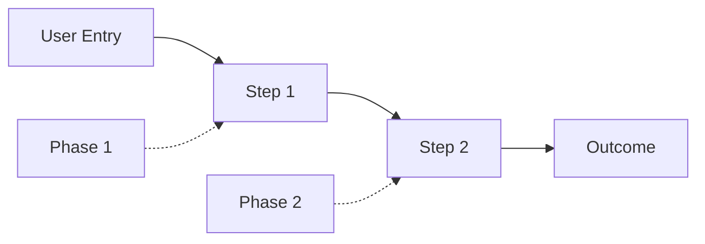

## Trigger

FULL bundle; always included alongside planning-scaffold. Carries the legacy `PLAN_TEMPLATE.md` (FULL) ticket-governance and ops sections that have no other owning pattern (required reading, agent assignment, demo path, risk/rollback, screenshot evidence, smoke impact, error handling, observability, test-catalog review, E2E-enablement, critical files).

## Header lines

None.

## Plan sections

## Required Reading

> List every document an agent MUST read before implementing this plan. Include architecture docs, related specs, parent plans, and key source files. This section survives context compaction and serves as the agent's rehydration checkpoint.

| Document | Why it matters |
|----------|----------------|
| `docs/architecture/<relevant-doc>.md` | [what from this doc shapes this work] |
| [`docs/plans/TICKET-XXX.specs.md`](TICKET-XXX.specs.md) | Technical source of truth |

---

## Agent Assignment Summary

| Agent        | LLM     | Phases   | Role          | Justification          |
| ------------ | ------- | -------- | ------------- | ---------------------- |
| **[named agent slug]** | [model] | [phases] | [role] | [why this prescribed agent is needed] |
| **Oracle / jOracle** | [model] | [phases] | [role] | [why needed] |

### Agent Tag Legend

| Tag                        | Meaning                      |
| -------------------------- | ---------------------------- |
| `@agent-name`              | Exact prescribed named agent |
| `@oracle-review`           | Requires Oracle consultation |
| `@frontend-ui-ux-engineer` | UI/UX specialist             |
| `@document-writer`         | Documentation                |

> **Routing rule:** Use exact named agents only (`@agent-name` or `task(subagent_type="agent-name", ...)`). Do not use `task(category=...)`; category dispatch can spawn `Sisyphus-Junior`.

---

## End-to-End Demo Path



| Step | User Action | Expected Result | Phase | Test(s)     | Status |
| ---- | ----------- | ---------------- | ----- | ----------- | ------ |
| 1    | [action]    | [result]         | P1    | `test_name` | 🔴     |
| 2    | [action]    | [result]         | P2    | `e2e_test`  | 🔴     |

---

## Risk / Rollback

- **Risk:** [primary risk]. Mitigation: [how to prevent it].
- **Risk:** [secondary risk]. Mitigation: [how to prevent it].
- **Rollback:** [how to revert this work without data migration or downstream damage].

---

## Screenshot Evidence

> Required for UI/Report changes. Delete section for backend-only work.

| Phase | Screenshots Required | Directory                               | Status |
| ----- | --------------------- | ---------------------------------------- | ------ |
| P[N]  | [descriptions]        | `docs/plans/screenshots/TICKET-XXX/pN/`  | 🔴     |

---

## Smoke Test Impact Assessment

- [ ] **[Feature Area 1]** - Changes to [describe]
- [ ] **[Feature Area 2]** - Changes to [describe]
- [ ] **API Endpoints** - Changes to API endpoints
- [ ] **Health Endpoints** - Changes to health checks

**Impact:** [None / Low / Medium / High]
**Action Required:** [None / Review smoke tests / Update assertions]

---

## Error Handling Strategy

> **MANDATORY SECTION** - Every plan must define how errors are handled. Silent failures violate project policy.

### Error Classification

| Error Type             | Example                       | Log Level  | User Feedback       | Recovery      |
| ----------------------- | ------------------------------ | ---------- | -------------------- | ------------- |
| **Expected absence**   | Data not available for region | `DEBUG`    | Graceful message    | Continue      |
| **Validation error**   | Invalid input from user       | `INFO`     | Clear error message | User retry    |
| **Dependency failure** | External API timeout          | `WARN`     | Retry indicator     | Auto-retry    |
| **System error**       | Database connection lost      | `ERROR`    | Error boundary      | Fail loudly   |
| **Critical failure**   | Data corruption detected      | `CRITICAL` | Stop operation      | Alert + block |

### This Feature's Error Scenarios

| Scenario                | Classification    | Handling           |
| ------------------------ | ------------------ | ------------------- |
| [Describe error case 1] | [Type from above] | [How it's handled] |
| [Describe error case 2] | [Type from above] | [How it's handled] |

### Logging Requirements

| Component      | Log Level Policy            | Rationale |
| -------------- | ---------------------------- | --------- |
| [API endpoint] | [level for success/failure] | [why]     |
| [Service]      | [level for success/failure] | [why]     |

### Anti-Patterns to Avoid

- [ ] **NO silent failures** - Every error must be logged or surfaced
- [ ] **NO catch-all swallowing** - `catch(e) {}` is forbidden
- [ ] **NO fallback substitution** - Don't silently use default values
- [ ] **NO wrong log levels** - 404 "not found" is NOT an error if expected

---

## Observability Requirements

> **MANDATORY SECTION**: transparent, debuggable systems prevent hours wasted on "hung" processes and silent failures. These requirements apply to both application code AND test code.

### Application Code

- [ ] **Structured logging**: All key operations log entry, exit, and duration. Use structured format (JSON or key=value) with correlation IDs where applicable.
- [ ] **Error context**: Every error log includes: operation name, input summary (not secrets), error type, and suggested next step.
- [ ] **Progress indicators**: Long-running operations (>5s) emit periodic progress logs (e.g., "Processing batch 3/10, 450 records").
- [ ] **Timeout messages**: Every timeout includes what was being waited for, how long it waited, and what the configured limit is.

### Test Code

- [ ] **Test progress output**: Every test logs its name and key steps as it runs. No silent tests that appear "hung" when they're actually working.
- [ ] **Assertion messages**: Every assertion includes a human-readable message explaining what was expected vs what was found.
- [ ] **Timeout assertions**: Tests that wait for async operations MUST have explicit timeouts with descriptive failure messages (not just "timeout exceeded").
- [ ] **Screenshot context**: Playwright screenshots include test name, step number, and timestamp in the filename.

### Hang Prevention

- [ ] **No unbounded waits**: Every `await`, `sleep`, poll loop, or external call has a timeout. Document the timeout value and rationale.
- [ ] **Heartbeat logging**: Processes that run >30s log a heartbeat every 10-15s showing they're still alive and what they're doing.
- [ ] **Fail loudly**: If a process is stuck, it must eventually timeout and report WHY it's stuck, not just silently hang.

---

## TEST_CATALOG.md Review

> Delete this section if the project does not use TEST_CATALOG.md. `TEST_CATALOG.md` is compatibility input, not the sole source of truth. Prefer architecture-level scenario inventories under `docs/architecture/*test-scenarios*.md` when available.

**Catalog Reviewed:** [Yes/No]
**Search Keywords:** `keyword1`, `keyword2`
**Catalog type:** manual | generated | hybrid | N/A
**Catalog source / generator:** `[tests/catalog/catalog.json + command]` or `N/A`

| Test File      | Test Name   | Relevant to A/C | Action              |
| --------------- | ----------- | ----------------- | -------------------- |
| `test_file.py` | `test_name` | A/C 1             | ✅ Use / ✏️ Upgrade |

If the project uses a generated catalog, do not hand-edit rendered inventory rows. Update the source metadata, run the project-approved generator/validator, and record the command/result in this plan.

---

## E2E Tests Enabled by This Ticket

> **MANDATORY SECTION (if project uses TEST_CATALOG.md or architecture test-scenario inventories)**: search for E2E tests and scenario contracts that list this ticket (or its parent Feature) as a **prerequisite**.
>
> The plan header's **`E2E policy`** controls **when** this work runs:
> - **`per-ticket`** → create / upgrade / run the relevant E2E tests near **plan completion**
> - **`deferred`** → document the enabled tests here, but defer creation/execution to later feature-level verification
>
> Delete this section only if the project has no TEST_CATALOG.md or zero E2E tests reference this ticket.

### How to populate this section

1. Find your ticket in the architecture-level test-scenario inventory or, for legacy projects, the **Feature → Ticket Mapping** table in `tests/TEST_CATALOG.md`:

   ```bash
   grep "TICKET-XXX" tests/TEST_CATALOG.md | head -10
   ```

   This tells you which Feature (F-XX) your ticket belongs to.

2. Search for E2E tests or scenario contracts that list your Feature as a prerequisite:

   ```bash
   grep -B2 "F-XX" tests/TEST_CATALOG.md | grep -E "^### E2E-|Prerequisites:" | head -20
   ```

3. For each matching E2E test, check if all OTHER prerequisite Features are already complete. If yes → this ticket's Feature is the final gate and the test becomes runnable.

4. Apply the plan header's **`E2E policy`**:
   - **`per-ticket`** → this runnable test MUST be created / upgraded / run near plan completion
   - **`deferred`** → record the test here and add a note that execution is deferred to feature-level verification

5. Check if the spec file already exists in the project's e2e test directory:
   - **Exists** → Mark as ✏️ Upgrade (add new assertions for this ticket's functionality)
   - **Does not exist** → Mark as 🆕 New (create from TEST_CATALOG.md spec)

### E2E Tests

| Test   | Spec File              | All Prerequisites Met?                              | Timing                       | Action               | Status |
| ------ | ----------------------- | ------------------------------------------------------ | ------------------------------ | --------------------- | ------ |
| E2E-XX | `e2e_XX_name.spec.ts`  | [Yes, runnable] / [No, TICKET-YY still pending]   | [per-ticket now / deferred]  | 🆕 New / ✏️ Upgrade | 🔴     |

### E2E QA Standards (NON-NEGOTIABLE)

When **`E2E policy: per-ticket`**, agents MUST follow this workflow:

1. **Read the full test definition** from `tests/TEST_CATALOG.md`; do NOT invent steps or assertions
2. **Create/update the spec file** using the stable live-show `uat-test.md` flow plus scenario contracts/catalog entries
3. **Run the test** against the production-like build (NOT dev server where possible), usually headless for regression mode
4. **Capture ALL listed screenshots** at the exact points specified in the catalog
5. **Use `look_at` only for asynchronous screenshot review** when the developer did not watch the live-show run or when visual evidence needs independent review
6. **Document results** in this plan file's Screenshot Evidence section with look_at verification notes
7. **Update TEST_CATALOG.md** status from ⬜ to 🟢 when the test passes. If the catalog is generated, update source metadata and re-render instead of hand-editing generated rows.
8. **Populate `Relevant UAT`** for Regression E2E/PE2E rows with the source live-show scenario ID, `uat-test.md` anchor, or `N/A ([reason])`

If **`E2E policy: deferred`**, do **not** silently skip this section. Record the deferred tests and explicitly note where/when they will run.

⚠️ **A per-ticket regression E2E test is NOT passing until structured assertions pass and required evidence artifacts are captured. `look_at` is supplemental visual review, not the primary proof when the live-show run was already observed.**

---

## Critical Files

| File                           | Purpose         |
| -------------------------------- | ----------------- |
| `[path/to/file.py]`            | [what it does]  |
| `[path/to/component.tsx]`      | [what it does]  |
| `[path/to/test_file.py]`       | [what it tests] |

## Rules

FULL-bundle governance/ops content with no other topical owner: required reading, agent assignment + tag legend + named-agent routing rule, the end-to-end demo path, FULL's risk/rollback wording (FEATURE's distinct wording is owned by `pattern.feature-governance.md`; the two are never co-selected into the same bundle, so the shared `## Risk / Rollback` heading text does not collide), screenshot evidence, smoke-test impact assessment, the mandatory error-handling and observability sections, TEST_CATALOG.md review, E2E-enablement discovery + QA standards, and the critical-files table.

Provenance: `PLAN_TEMPLATE.md` §§ Required Reading, Agent Assignment Summary, End-to-End Demo Path, Risk/Rollback, Screenshot Evidence, Smoke Test Impact Assessment, Error Handling Strategy, Observability Requirements, TEST_CATALOG.md Review, E2E Tests Enabled by This Ticket, Critical Files. Restored, new pattern; see `.jswarm/plans/TICKET-XXX/TICKET-XXX.dedrift-ledger.md` for the restoration ledger rows.
